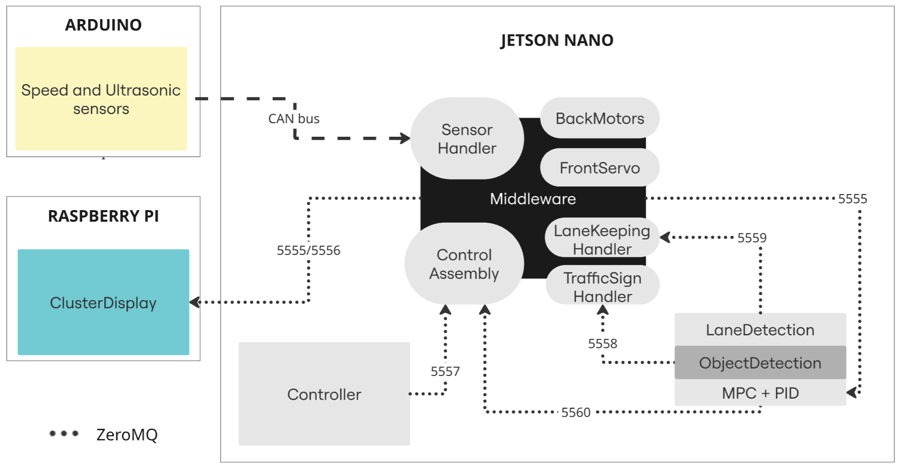

# Team06 Autonomous Vehicle Project

An autonomous vehicle system that combines instrument cluster display with comprehensive autonomous driving capabilities. The system provides both visual feedback through a modern digital dashboard and advanced autonomous driving features including lane keeping assistance, traffic signal detection, and vehicle control.

## Project Overview

This repository contains all the core components for an autonomous vehicle system:

1. **Instrument Cluster** - Digital dashboard displaying vehicle telemetry and status
2. **Lane Detection** - Part of the Lane Keeping Assisting System that detects and shows lane deviations
3. **Object Detection** - Identifies traffic signals
4. **MPC (Model Predictive Control)** - Advanced control algorithm used in autonomous driving for optimal path planning
5. **PID Controller** - Proportional-Integral-Derivative controller used in autonomous driving for precise vehicle control
6. **Controller** - Handles vehicle control inputs and user interactions
7. **Middleware** - Central data processing and distribution hub

## Architecture



- ZeroMQ-based communication between components
- Modular architecture with independent, replaceable components
- Real-time data processing and visualization

## Project Structure

- `/Controller` - Vehicle control input processing and user interface
- `/Middleware` - Central data hub and message broker for all components
- `/modules` - Core autonomous driving modules
  - `cluster-display` - Digital instrument cluster interface
  - `lane-detection` - Lane Detection system (includes MPC, PID and Object Detection inference)
- `/scripts` - Build and test automation
  - `build.sh` - Main build script
  - `run_tests.sh` - Test execution script
  - `run_linters.sh` - Code quality checks
  - `run_coverage.sh` - Coverage report generation
- `/zmq` - ZeroMQ communication layer
- `/CICD` - Continuous Integration configuration
- `/Arduino` - Arduino code

## Building

Prerequisites:
- C++17 compiler
- CMake 3.10+
- ZeroMQ (libzmq3-dev)
- Qt 5.9+ (for display interface)
- OpenCV (for computer vision)
- CUDA (for GPU acceleration)

Build steps:
```bash
# Initialize and update submodules
git submodule update --init --recursive

# Build the project
./scripts/build.sh
```

## Running

Start components in order:
```bash
./build/bin/Middleware
./build/bin/ClusterDisplay
./build/bin/Controller
```

## Code Quality

### Linting

Run the linter to check code quality:
```bash
# Check for formatting issues only (default, safe for CI)
./scripts/run_linters.sh

# Fix formatting issues automatically
./scripts/run_linters.sh --fix

# Run full static analysis (clang-tidy) for local development
./scripts/run_linters.sh --with-tidy

# Combine flags: fix formatting and run static analysis
./scripts/run_linters.sh --fix --with-tidy
```

The linter checks:
- **Code formatting** (clang-format) - Always enabled
- **Static analysis** (clang-tidy) - Enabled with `--with-tidy` flag

**Note**: By default, the linter runs in format-only mode to ensure compatibility with CI environments. Use `--with-tidy` for comprehensive static analysis during local development.

### Testing

Run the test suite:
```bash
./scripts/run_tests.sh
```

### Test Coverage

To generate and view test coverage reports:
```bash
# Generate basic coverage report
./scripts/run_coverage.sh

# Generate HTML coverage report
./scripts/run_coverage.sh --html

# Specify custom output directory
./scripts/run_coverage.sh --output=./my-coverage-reports --html
```

The coverage report provides detailed information about:
- Line coverage
- Branch coverage
- Function coverage
- Uncovered code regions

**Coverage Requirements**: The project maintains a minimum code coverage of **80%**. The CI/CD pipeline will fail if coverage falls below this threshold. Current coverage: **81.3% line coverage, 93.2% function coverage**.

#### Accessing CI Coverage Reports

Coverage reports from CI runs are available:
1. Go to your GitHub repository
2. Click on "Actions"
3. Select a workflow run
4. Scroll to "Artifacts"
5. Download "coverage-reports-[run-number]"

## Continuous Integration

The project uses GitHub Actions for automated:
- Code linting and style checking
- Building on multiple platforms
- Running unit and integration tests
- Code coverage analysis
- Deployment to Jetson Nano hardware

See [CICD Documentation](CICD/README.md) for details.

## Module Documentation

Each module maintains its own detailed documentation:
- [Controller](Controller/README.md) - Vehicle control input processing
- [Middleware](Middleware/README.md) - Central data hub and message broker
- [Cluster Display](https://github.com/SEAME-pt/Team06_DES_Instrument-Cluster/blob/main/README.md) - Digital instrument cluster interface
- [Lane Detection](https://github.com/SEAME-pt/Team06_ADS_Autonomous-Lane-Detection/blob/main/README.md) - Lane Detection, PID, MPC
- [Object Detection](https://github.com/SEAME-pt/Team06_ADS_Object-Detection-and-Avoidance/blob/yolo/README.md) - YOLO Traffic Sign Detection Architecture
